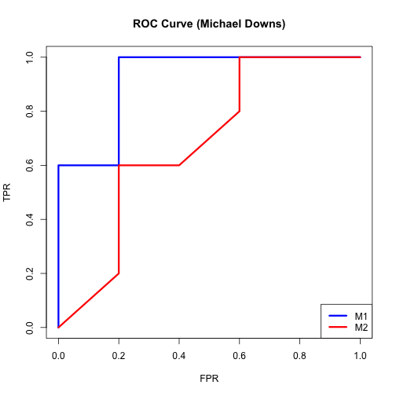

Adaboost algo using rpart() decision tree as weak learner. 
========================================================

AdaBoost is the most popular boosting algo. Boosting is the best off-the-self-classifier.  

### Initialize data


```r
library(rpart)

setwd("./data")

train<-read.csv("sonar_train.csv",header=F)
test<-read.csv("sonar_test.csv",header=F)

setwd("../")

y_train<-train[,61]
x_train<-train[,1:60]

y_test<-test[,61]
x_test<-test[,1:60]
```

### Add vectors to track results on each iteration

Start by:
- Setting vectors to track training and test errors for plotting.
- Setting a vector f = zero for all xi. At the end, if the value for an observation in this vector is >1, it will be positive, else negative. 


```r
## Track the training and test errors for each of 500 revs.
train_error<-rep(0,500)
test_error<-rep(0,500)

## Track "f", the weighted vote of the decision trees applied to train and test data. 
f_train<-rep(0,130)
f_test<-rep(0,78)

i<-1 ## iteration number
```

### Set up your loop

For m observations [m] and 500 iterations [i]:

As it runs thru tree and seeks to minimize Gini index, it does so including the observation weight resulting in a weighted Gini index. (You can give weights to Rpart so that it knows how to weight.)


```r
while(i<=500) {
     w<-exp(-y_train*f_train)
     ## Initialize vector of weights (w[m]) as exp of the y_train and 0'd f_train vectors.
     ## After compute weights as e(-y*f) where f=∑(i=0,M)alpha[m]*g[m] for prior iterations.

     w<-w/sum(w)
     ## Normalize weights (w[m]) at 1/N  for all obs. Ensures they sum to 1. 
     
     fit<-rpart(y_train~.,x_train,w,method="class")
     ## Fit classifier (decision tree w/ rpart) to the training data using the weights w[m].
     
     g_train<--1+2*(predict(fit,x_train)[,2]>0.5)
     ## Calculate g[m] flagging successful (1) and unsuccessful (-1) predictions for each x[i]. Use later to +weight or -weight observations. 
     
     g_test<--1+2*(predict(fit,x_test)[,2]>0.5)
     ## Do the same calculation for the test set
     
     e<-sum(w*(y_train*g_train<0))
     ## Compute the weighted (w[m]) misclass errors (e[m]) i.e., sum of weights for each obs classed incorrectly (g_train<0). This is the weight we will use for the majority vote. So, after the terations, we'll weight trees that performed best overall.
     
     alpha<-0.5*log((1-e)/e)
     ## Compute alpha: 1/2 log odds of the sum of the misclass errors (e[m]). This becomes the weight of the tree. So, if sum of weighted misclass is large, the tree weight will be small and vice versa.
     
     f_train<-f_train+alpha*g_train
     ## Take the prior f_train[m] vector and add to it the tree weight (alpha) * the individual observation values (g[m]) vector. This combines tree and observation weights cumulating our weighted vote of each of our trees.
     
     f_test<-f_test+alpha*g_test
     ## Update the prediction on the test data set.
     
     train_error[i]<-sum(1*f_train*y_train<0)/130
     ## Compute and save the training error (i.e., f_train * y_train where y_train<0) for this run (of 500). Basically answers the question, "Which obs would I misclassify if I stopped right now.""
    
     test_error[i]<-sum(1*f_test*y_test<0)/78
     ## Same as above, but applied to test data set.
     
     i<-i+1
     
     ## Now go back up. Replace previous weights w[m] with w[m]*e^-(alpha[m])(g[m](x[i]))*yi. This will help tree focus on observations we've been misclassifying so far. Key points:
     
     ## 1. If y[i] = g[m](x[i]), then test class = predicted class and the product g[m](x[i])*y[i] will = 1. If not (i.e., an incorrect classifiation) it will be -1, 
     
     ## 2. Because we're taking e^-alpha[m] if it's correct, we're adding e^-alpha[m]. Otherwise, we're deducting e^-alpha[m],
     
     ## 3. Recall that if the prediction is correct, e^-alpha[m] is less than one and it will down-weight the weight. If incorrect, it's greater than one and you up-weight. 
     
     ## Fit a new classifer using the new weights.
}
```

### Plot your graphic


```r
plot(seq(1,500),test_error,type="l",ylim=c(0,0.5),ylab="Error Rate",
     xlab="Iterations",lwd=2,col="black")
lines(train_error,lwd=2,col="purple")
legend(4,0.5,c("Training Error","Test Error"),col=(c("purple","black",lwd=2)))
```

 
