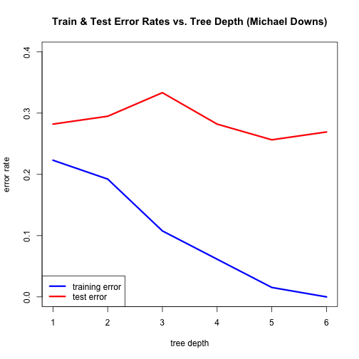

## HW3 problem 6.

For Sonar, plot training and the test errors as a function of tree depth. Use rpart() with default values except control=rpart.control(minsplit=0,minbucket=0,cp=-1, maxcompete=0, maxsurrogate=0, usesurrogate=0, xval=0,**maxdepth=dep**). Provide legend, label axes, and include name in the title. **What dep is optimal for test error?**

### Load sonar datasets


```r
library(rpart)

setwd("./data")

train<-read.csv("sonar_train.csv",header=F)
test<-read.csv("sonar_test.csv",header=F)

setwd("../")

y<-as.factor(train[,61])
x<-train[,1:60]

y_test<-as.factor(test[,61])
x_test<-test[,1:60] 
```

### Run model for tree depths saving training and test errors. 


```r
errors<-matrix(data=NA,nrow=6,ncol=3)

for(dep in 1:6){
     errors[dep,1]<-dep
     fit<-rpart(y~.,x,control=rpart.control(minsplit=0,minbucket=0,cp=-1,maxcompete=0,
                                            xval=0,maxdepth=dep,)) 
     
     errors[dep,2]<-sum(y!=predict(fit,x,type="class"))/length(y)
     errors[dep,3]<-sum(y_test!=predict(fit,x_test,
                                      type="class"))/length(y_test)
     }
```

### Output graph


```r
plot(errors[,2]~errors[,1],type="l",col="blue",
     main="Train & Test Error Rates vs. Tree Depth (Michael Downs)",
     xlab="tree depth",ylab="error rate",ylim=c(0,0.4),lwd=3)

lines(errors[,3]~errors[,1],type="l",col="red",lwd=3)

legend("bottomleft",col=c("blue","red"),lwd=3,legend=c("training error","test error"))
```

 

### Answer question


```r
minVal<-errors[which.min(errors[,3]),3]
minDep<-errors[which.min(errors[,3]),1]
print(c("Lowest test error of ",round(minVal,3),"and tree depth of ",minDep))
```

```
## [1] "Lowest test error of " "0.256"                 "and tree depth of "   
## [4] "5"
```
