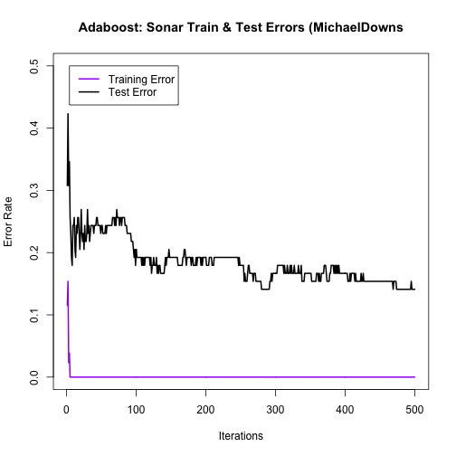
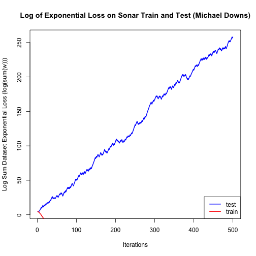

hw4p6b
========================================================

### Load test and train data

```r
setwd("./data")
train<-read.csv("sonar_train.csv",header=FALSE)
test<-read.csv("sonar_test.csv",header=FALSE)
setwd("../")

y<-train[,61]
x<-train[,1:60]
y_test<-test[,61]
x_test<-test[,1:60]
```

## Using baseline alpha

### Initialize counters
 

```r
iter=500

train_error<-rep(0,iter) # Keep track of errors
test_error<-rep(0,iter)
f<-rep(0,130) # 130 pts in training data
f_test<-rep(0,78) # 78 pts in test data

sumW<-rep(0,iter)
sumW_test<-rep(0,iter)

sumWnorm<-rep(0,iter)
sumWnorm_test<-rep(0,iter)
```

### Process Baseline Adboost loop


```r
i<-1
library(rpart)

while(i<=iter){
     w<-exp(-y*f) # This is a shortcut to compute w
     sumW[i]<-sum(w)
     
     w_test<-exp(-y_test*f_test)
     sumW_test[i]<-sum(w_test)
     
     w<-w/sum(w)
     sumWnorm[i]<-sum(w)
     
     w_test<-w_test/sum(w_test)
     sumWnorm_test[i]<-sum(w_test)

     fit<-rpart(y~.,x,w,method="class")

     g<--1+2*(predict(fit,x)[,2]>.5) # make -1 or 1
     g_test<--1+2*(predict(fit,x_test)[,2]>.5)

     e<-sum(w*(y*g<0))
     
     alpha<-.5*log ( (1-e) / e )

     f<-f+alpha*g
     f_test<-f_test+alpha*g_test

     train_error[i]<-sum(1*f*y<0)/130
     test_error[i]<-sum(1*f_test*y_test<0)/78

     i<-i+1
}
print(min(test_error)) # minimum test error
```

```
## [1] 0.141
```

```r
print(which.min(test_error)) # minimum test error iteration
```

```
## [1] 280
```

```r
print(test_error[iter]) # final test error
```

```
## [1] 0.141
```

```r
sumW_base<-sumW
sumW_test_base<-sumW_test
train_error_base<-train_error
test_error_base<-test_error
```

## Using shrink alpha

### Re-initialize counters
 

```r
iter=500

train_error<-rep(0,iter) # Keep track of errors
test_error<-rep(0,iter)
f<-rep(0,130) # 130 pts in training data
f_test<-rep(0,78) # 78 pts in test data

sumW<-rep(0,iter)
sumW_test<-rep(0,iter)

sumWnorm<-rep(0,iter)
sumWnorm_test<-rep(0,iter)
```

### Process shrink Adboost loop


```r
i<-1

while(i<=iter){
     w<-exp(-y*f) # This is a shortcut to compute w
     sumW[i]<-sum(w)
     
     w_test<-exp(-y_test*f_test)
     sumW_test[i]<-sum(w_test)
     
     w<-w/sum(w)
     sumWnorm[i]<-sum(w)
     
     w_test<-w_test/sum(w_test)
     sumWnorm_test[i]<-sum(w_test)

     fit<-rpart(y~.,x,w,method="class")

     g<--1+2*(predict(fit,x)[,2]>.5) # make -1 or 1
     g_test<--1+2*(predict(fit,x_test)[,2]>.5)

     e<-sum(w*(y*g<0))
     
     alpha<-0.1*(.5*log ( (1-e) / e ))

     f<-f+alpha*g
     f_test<-f_test+alpha*g_test

     train_error[i]<-sum(1*f*y<0)/130
     test_error[i]<-sum(1*f_test*y_test<0)/78

     i<-i+1
}
print(min(test_error)) # minimum test error
```

```
## [1] 0.1538
```

```r
print(which.min(test_error)) # minimum test error iteration
```

```
## [1] 125
```

```r
print(test_error[iter]) # final test error
```

```
## [1] 0.1923
```

```r
sumW_shrink<-sumW
sumW_test_shrink<-sumW_test
train_error_shrink<-train_error
test_error_shrink<-test_error
```

## Output errors graphic


```r
# plot log(w)
plot(seq(1,iter),test_error_shrink,type="l",ylim=c(0,0.4),ylab="Error Rate",
     xlab="Iterations",lwd=2,col="red4",main="Sonar Train & Test Errors with/without Shrinkage (MichaelDowns")

lines(test_error_base,type="l",col="red1",lwd=3)
lines(train_error_shrink,type="l",col="blue",lwd=3)
lines(train_error_base,type="l",col="lightblue",lwd=3)

legend("topright",0.5,
       c("Test Error w/ Shrinkage", "Test Error Baseline (no shrink)","Train Error w/ Shrinkage","Train Error Baseline (no shrink"),
       col=(c("red4","red1","blue","lightblue")),lwd=3)
```

 

### Output log(sum(w)) graphic


```r
# plot log(w)
plot(seq(1,iter),log(sumW_test_shrink),type="l",
     ylab="Sum of Dataset Exponential Loss (log(sum(w)))",
     xlab="Iterations",col="red4",lwd=2,ylim=c(0,250),
     main="Sonar Train & Test Exponential Loss with/without Shrinkage (Michael Downs)")

lines(log(sumW_test_base),type="l",col="red1",lwd=3)
lines(log(sumW_shrink),type="l",col="blue",lwd=3)
lines(log(sumW_base),type="l",col="lightblue",lwd=3)

legend("topleft",0.5,
       c("Test Data w/ Shrinkage", "Test Data Baseline (no shrink)","Train Data w/ Shrinkage","Train Data Baseline (no shrink"),
       col=(c("red4","red1","blue","lightblue")),lwd=3)
```

 
