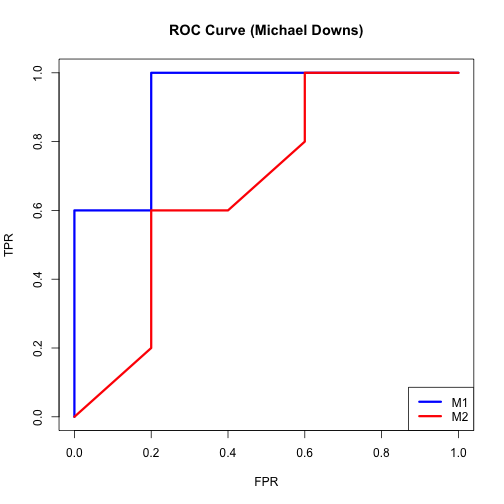
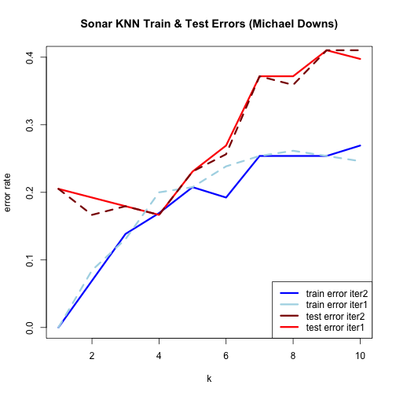

hw4q2 - KNN on sonar data
========================================================

## q2a

### Load data, libs


```r
setwd("./data")

train<-read.csv("sonar_train.csv",header=F)
test<-read.csv("sonar_test.csv",header=F)

setwd("../")

library(class)
```

### Create training and test sets


```r
# create x and y training vars
y<-as.factor(train[,61])
x<-train[,1:60]

# create x and y test vars
y_test<-as.factor(test[,61])
x_test<-test[,1:60]
```

### Fit models varying k. Assess fit on train and test data. 


```r
iter<-10

errors<-matrix(data=NA,nrow=iter,ncol=3)
colnames(errors)<-c("k","train","test")

for(i in 1:iter){
     errors[i,1]<-i
     
     # fit model on training data
     fit.tr<-knn(x,x,cl=y,k=i)
     
     # calculate/log training error
     errors[i,2]<-1-sum(y==fit.tr)/length(y)
     
     # fit model on test data
     fit.te<-knn(x,x_test,y,k=i)
     
     # calculate/log test error
     errors[i,3]<-1-sum(y_test==fit.te)/length(y_test)
}
```

### Output graph


```r
plot(errors[,2]~errors[,1],type="l",col="blue",
     main="Sonar KNN Train & Test Errors (Michael Downs)",
     xlab="k",ylab="error rate",ylim=c(0,0.4),lwd=3)

lines(errors[,3]~errors[,1],type="l",col="red4",lwd=3)

legend("bottomright",col=c("blue","red4"),lwd=3,
       legend=c("training error","test error"))
```

 

### Answer question


```r
minVal<-errors[which.min(errors[,3]),3]
minK<-errors[which.min(errors[,3]),1]
print(c("Lowest test error of ",round(minVal,3),"and k of ",minK))
```

```
##                                            test                         
## "Lowest test error of "                 "0.167"             "and k of " 
##                       k 
##                     "2"
```

## q2b

### Save off errors


```r
errors1<-errors
```

### Load data, libs


```r
setwd("./data")

train<-read.csv("sonar_train.csv",header=F)
test<-read.csv("sonar_test.csv",header=F)

setwd("../")

library(class)
```

### Create training and test sets


```r
# create x and y training vars
y<-as.factor(train[,61])
x<-train[,1:60]

# create x and y test vars
y_test<-as.factor(test[,61])
x_test<-test[,1:60]
```

### Fit models varying k. Assess fit on train and test data. 


```r
iter<-10

errors<-matrix(data=NA,nrow=iter,ncol=3)
colnames(errors)<-c("k","train","test")

for(i in 1:iter){
     errors[i,1]<-i
     
     # fit model on training data
     fit.tr<-knn(x,x,cl=y,k=i)
     
     # calculate/log training error
     errors[i,2]<-1-sum(y==fit.tr)/length(y)
     
     # fit model on test data
     fit.te<-knn(x,x_test,y,k=i)
     
     # calculate/log test error
     errors[i,3]<-1-sum(y_test==fit.te)/length(y_test)
}
```

### Plot both sets of errors


```r
plot(errors[,2]~errors[,1],type="l",col="blue",
     main="Sonar KNN Train & Test Errors (Michael Downs)",
     xlab="k",ylab="error rate",ylim=c(0,0.4),lwd=3)

lines(errors[,3]~errors[,1],type="l",col="red1",lwd=3)

lines(errors1[,2]~errors1[,1],type="l",col="light blue",lwd=3,lty=2)
lines(errors1[,3]~errors1[,1],type="l",col="red4",lwd=3,lty=2)

legend("bottomright",col=c("blue","lightblue","red4","red1"),lwd=3,
       legend=c("train error iter2","train error iter1", "test error iter2","test error iter1"))
```

 

### Answer question


```r
minVal<-errors[which.min(errors[,3]),3]
minK<-errors[which.min(errors[,3]),1]
print(c("Lowest test error of ",round(minVal,3),"and k of ",minK))
```

```
##                                            test                         
## "Lowest test error of "                 "0.167"             "and k of " 
##                       k 
##                     "4"
```
