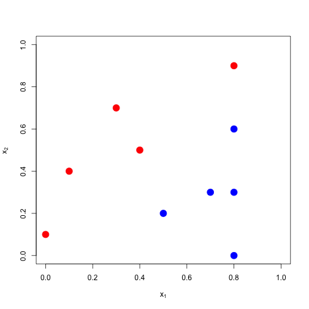

hw4q3
========================================================

## q3a

### Load data


```r
library(e1071)

x1<-c(0,0.8,0.4,0.3,0.1,0.7,0.5,0.8,0.8,0.8)
x2<-c(0.1,0.9,0.5,0.7,0.4,0.3,0.2,0.6,0,0.3)
x<-cbind(x1,x2)
y<-as.factor(c(-1,-1,-1,-1,-1,1,1,1,1,1))
```

### Start plot


```r
plot(x,pch=19,xlim=c(0,1),ylim=c(0,1),col=2*as.numeric(y),cex=2,
     xlab=expression(x[1]),ylab=expression(x[2])) 
```

 

### Fit model

Use svm() with kernel="linear" and cost=100000 to fit the toy 2D data below. Provide a plot of the resulting class rule. 


```r
fit<-svm(x=x,y=y,kernel="linear",cost=100000)

1-sum(y==predict(fit,x))/length(y)
```

```
## [1] 0
```

### Color sections

To visualize classification, generate numbers, run them thru model, and color the output based on the label (class) prediction. 


```r
big_x<-matrix(runif(200000),ncol=2,byrow=T)

plot(big_x,col=rgb(0.5,0.5,0.2+0.6*as.numeric(predict(fit,big_x)==1)),pch=19)
points(x,pch=19,xlim=c(0,1),ylim=c(0,1),col=2*as.numeric(y),cex=2,
     xlab=expression(x[1]),ylab=expression(x[2]))

abline(-0.05,1,lwd=6)
```

 
