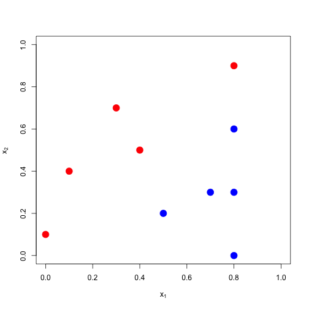
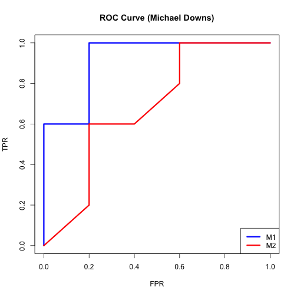
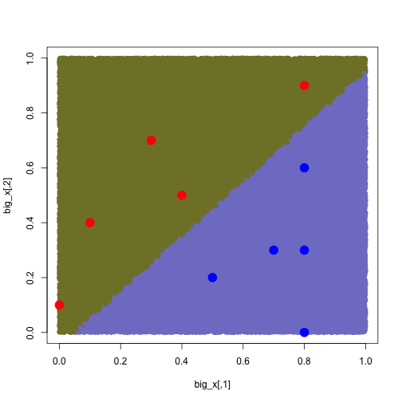
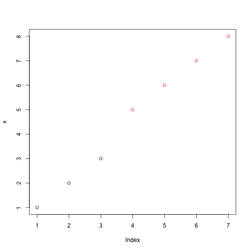

KMeans
========================================================

### Clustering cluster.csv

Use kmeans() w/ default values to find the k=2 solution for the 2-dimensional data cluster.csv


```r
setwd("./data")
data<-read.csv("cluster.csv",header=F)
setwd("../")
```

Plot initial data.


```r
plot(data)
```

 

Cluster: kmeans() produces centers, cluster assignments, etc.


```r
fit<-kmeans(data,2)
fit
```

```
## K-means clustering with 2 clusters of sizes 49, 51
## 
## Cluster means:
##        V1      V2
## 1 0.99128 1.07899
## 2 0.02169 0.08866
## 
## Clustering vector:
##   [1] 2 2 2 2 2 2 2 2 2 2 2 2 2 2 2 2 2 2 2 2 2 2 2 2 2 2 2 2 2 2 2 2 2 2 2
##  [36] 2 2 2 2 2 2 2 2 2 2 2 2 2 2 2 1 1 1 1 1 1 1 2 1 1 1 1 1 1 1 1 1 1 1 1
##  [71] 1 1 1 1 1 1 1 1 1 1 1 1 1 1 1 1 1 1 1 1 1 1 1 1 1 1 1 1 1 1
## 
## Within cluster sum of squares by cluster:
## [1] 9.398 7.489
##  (between_SS / total_SS =  74.0 %)
## 
## Available components:
## 
## [1] "cluster"      "centers"      "totss"        "withinss"    
## [5] "tot.withinss" "betweenss"    "size"         "iter"        
## [9] "ifault"
```

```r
fit$centers
```

```
##        V1      V2
## 1 0.99128 1.07899
## 2 0.02169 0.08866
```

Plot: Key here is to use kmeans() output rather than moving data around. 


```r
plot(data$V1,data$V2,col=fit$cluster)
points(fit$centers,col=c("black","red"),pch=19)
```

 

### Clustering sonar

Use kmeans() w/ default values to find the k=2 solution for the 2-dimensional sonar data.


```r
setwd("./data")
train<-read.csv("sonar_train.csv",header=F)
test<-read.csv("sonar_test.csv",header=F)
setwd("../")
```

Plot just the first two columns of the sonar data.


```r
plot(train[,1:2])
```

 

Cluster: kmeans() can use as many attributes as you want. But, let's look at the clusters created by the first two. 


```r
fit<-kmeans(train[,1:2],2)
fit
```

```
## K-means clustering with 2 clusters of sizes 112, 18
## 
## Cluster means:
##        V1      V2
## 1 0.02235 0.02768
## 2 0.06808 0.09337
## 
## Clustering vector:
##   [1] 1 2 1 1 1 1 2 2 1 1 1 1 1 2 1 1 1 1 1 1 1 1 2 1 1 1 1 1 1 1 1 1 1 1 1
##  [36] 1 1 1 1 1 1 2 1 1 1 1 1 1 1 1 1 2 1 1 1 1 1 1 1 1 2 1 1 1 1 2 1 1 1 1
##  [71] 1 1 1 2 1 1 1 1 1 1 1 1 1 2 1 1 1 2 1 1 1 1 1 2 1 1 1 1 1 1 1 1 1 1 1
## [106] 1 1 2 1 1 1 2 1 2 1 1 1 1 1 1 1 2 1 1 1 1 2 1 1 1
## 
## Within cluster sum of squares by cluster:
## [1] 0.0434 0.0305
##  (between_SS / total_SS =  57.3 %)
## 
## Available components:
## 
## [1] "cluster"      "centers"      "totss"        "withinss"    
## [5] "tot.withinss" "betweenss"    "size"         "iter"        
## [9] "ifault"
```

Plot: Key here is to use kmeans() output rather than moving data around. 


```r
plot(train[,1:2],col=fit$cluster)
points(fit$centers,col="blue",pch=19)
```

 

### Compare sonar clusters to actual class labels??


```r
plot(train[,1:2],pch=19,xlab=expression(x[1]),
     ylab=expression(x[2]))
## get your y labels
y<-train[,61]
## re-plot points with color based on class labels.
points(train[,1:2],col=2+2*y,pch=19)
```

 

### Compute the misclass error

What if we used kmeans() to classify. What would our misclass error be?


```r
## transform cluster labels (1's and 2's) to -1s and 1s
sum(fit$cluster*2-3==y)/length(y)
```

```
## [1] 0.4462
```

### Try it for all 60 columns


```r
fit<-kmeans(train[,1:60],2)
sum(fit$cluster*2-3==y)/length(y)
```

```
## [1] 0.6
```

```r
sum(fit$cluster*2-3!=y)/length(y)
```

```
## [1] 0.4
```

Try w/ more centroids. Disaster.


```r
fit<-kmeans(train[,1:60],10)
sum(fit$cluster*2-3==y)/length(y)
```

```
## [1] 0.1154
```

```r
sum(fit$cluster*2-3!=y)/length(y)
```

```
## [1] 0.8846
```

Gist: kmeans() is a good clustering tool. Not a good prediction tool.

### What is kmeans doing? 

First code it manually. 


```r
x<-c(1,2,3,5,6,7,8)
center1<-1
center2<-2

for (k in 2:10) {
     cluster1<-x[abs(x-center1[k-1])<=abs(x-center2[k-1])]
     ## Put in cluster1 all x's where distance to c1<= distance to c2.
     cluster2<-x[abs(x-center1[k-1])>abs(x-center2[k-1])]
     ## Put in c2 all x's where distance to c1>distance to c2
     
     center1[k]<-mean(cluster1)
     center2[k]<-mean(cluster2)
     ## apparently mean() will take the mean between of all values in a cluster.
     ## set k=2. Decrement it 1 to control iteration. Also use it to track the updates clusters. 
}

center1
```

```
##  [1] 1 1 2 2 2 2 2 2 2 2
```

```r
center2
```

```
##  [1] 2.000 5.167 6.500 6.500 6.500 6.500 6.500 6.500 6.500 6.500
```

```r
cluster1
```

```
## [1] 1 2 3
```

```r
cluster2
```

```
## [1] 5 6 7 8
```

Compare to kmeans()


```r
x<-c(1,2,3,5,6,7,8)

fit<-kmeans(x,2)

plot(x,col=fit$cluster)
```

 


