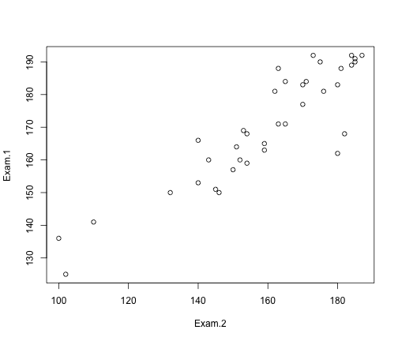
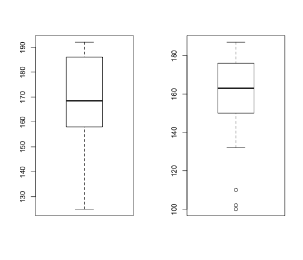
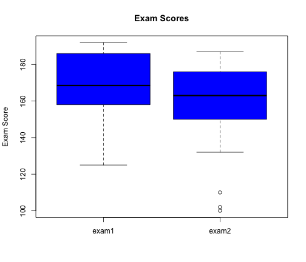
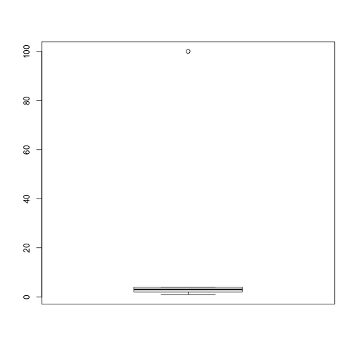
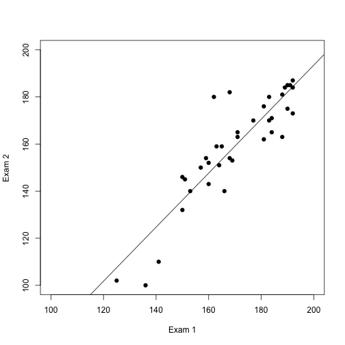
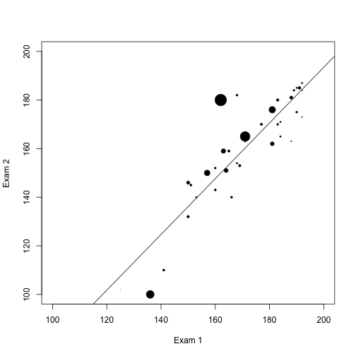
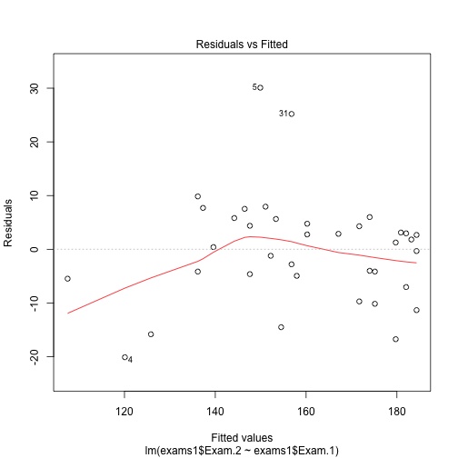
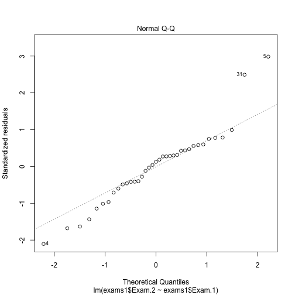
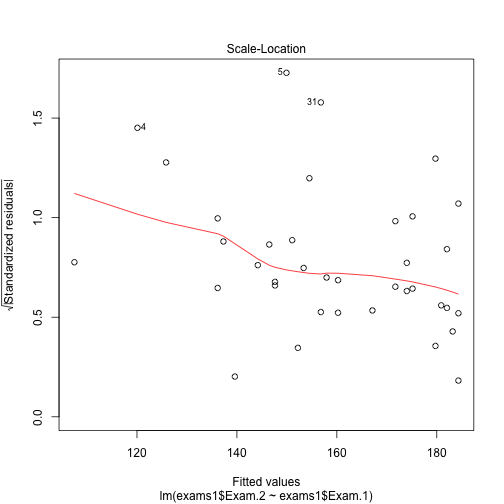
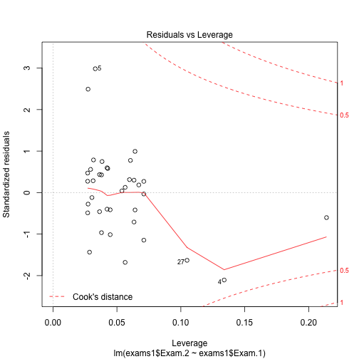

Outliers
========================================================

## In-Class Exercise #50

Alalyze exam data. Find outliers. 

### Read data


```r
setwd("./data")
exams<-read.csv("exams_and_names-2.csv",header=T)
setwd("../")
```

### Using boxplot w/ interquartile range

Key is using measure which is natural to the data set e.g., quartiles on distribution. Recall:
- Box goes to 25% (Q1) and 75% (Q3)
- Whiskers go to 1.5x Q1-Q3 range
- Beyond that are outliers


```r
with(exams,plot(Exam.1~Exam.2))
```

 

```r
par(mfrow=c(1,2))
with(exams,boxplot(Exam.1)) # no outliers
with(exams,boxplot(Exam.2)) # three outliers
```

 

```r
par(mfrow=c(1,1))
boxplot(exams$Exam.1,exams$Exam.2,col="blue",main="Exam Scores",
        names=c("exam1", "exam2"),ylab="Exam Score")
```

 

### Using z score


```r
sd1<-sd(exams$Exam.1,na.rm=T)
sd2<-sd(exams$Exam.2,na.rm=T)

exams$Exam.1.z<-(exams$Exam.1-mean(exams$Exam.1,na.rm=T))/sd1
exams$Exam.2.z<-(exams$Exam.2-mean(exams$Exam.2,na.rm=T))/sd2

# Note: default for scale is to set na.rm=T
exams$Exam.1.scale<-scale(exams$Exam.1)
exams$Exam.2.scale<-scale(exams$Exam.2)

head(sort(exams$Exam.2.z))
```

```
## [1] -2.6481 -2.5586 -2.2009 -1.2171 -0.8593 -0.8593
```

```r
head(sort(exams$Exam.2.z,decreasing=T))
```

```
## [1] 1.242 1.153 1.153 1.108 1.108 1.019
```

```r
# No outliers
```

## In-Class Exercise #52

Alalyze exam data. Find outliers using IQR. **Considered better than mean/sd as they are sensitive to outliers.**

### Calculating / using IQR


```r
# 1. get 1st and 3rd quantiles
q1<-quantile(exams$Exam.2,0.25,na.rm=T)
q3<-quantile(exams$Exam.2,0.75,na.rm=T)

# 2. calc iqr
iqr<-q3-q1

# 3. find outliers
outliers<-exams[exams$Exam.2>=q3+(1.5*iqr) | exams$Exam.2<=q1-(1.5*iqr),]
outliers
```

```
##          Student Exam.1 Exam.2 Exam.1.z Exam.2.z Exam.1.scale Exam.2.scale
## 4     Student #4    136    100   -1.925   -2.648       -1.925       -2.648
## NA          <NA>     NA     NA       NA       NA           NA           NA
## 23   Student #23    125    102   -2.555   -2.559       -2.555       -2.559
## NA.1        <NA>     NA     NA       NA       NA           NA           NA
## NA.2        <NA>     NA     NA       NA       NA           NA           NA
## 30   Student #30    141    110   -1.639   -2.201       -1.639       -2.201
```

```r
# 3 outliers
```

### Example of why iqr better: outliers skew mean/sd


```r
data<-c(1,2,3,4,100)
boxplot(data)
```

 

```r
# shows outliers

sd3<-sd(data)
mean1<-mean(data)
zscores<-(data-mean1)/sd3
zscores
```

```
## [1] -0.4815 -0.4585 -0.4356 -0.4127  1.7883
```

```r
# no outliers
```

### iqr not perfect. some distributions are broad


```r
# example: T distribution w/ low degrees of freedom. It's just the distribution.
boxplot(rt(50,df=1))
```

 

## Detecting outliers for multiple attributes

### In-class #52: Using regression

First use basic lm to plot regression line for the data.


```r
# load/clean data
setwd("./data")
exams<-read.csv("exams_and_names-2.csv",header=T)
setwd("../")
exams1<-exams[!is.na(exams[,3]),]

# fit model
fit<-lm(exams$Exam.2~exams$Exam.1)
summary(fit)
```

```
## 
## Call:
## lm(formula = exams$Exam.2 ~ exams$Exam.1)
## 
## Residuals:
##    Min     1Q Median     3Q    Max 
## -20.09  -4.95   1.26   4.76  30.08 
## 
## Coefficients:
##              Estimate Std. Error t value Pr(>|t|)    
## (Intercept)  -35.9039    16.8035   -2.14     0.04 *  
## exams$Exam.1   1.1470     0.0983   11.67  1.3e-13 ***
## ---
## Signif. codes:  0 '***' 0.001 '**' 0.01 '*' 0.05 '.' 0.1 ' ' 1
## 
## Residual standard error: 10.3 on 35 degrees of freedom
##   (3 observations deleted due to missingness)
## Multiple R-squared:  0.796,	Adjusted R-squared:  0.79 
## F-statistic:  136 on 1 and 35 DF,  p-value: 1.28e-13
```

```r
# plot results
plot(exams$Exam.1,exams$Exam.2,pch=19,xlab="Exam 1", ylab="Exam 2", xlim=c(100,200),
     ylim=c(100,200))
abline(fit)
```

 

```r
# inspect residuals
sort(fit$residuals)
```

```
##        4       17       30       39       11       13        7       19 
## -20.0930 -16.7389 -15.8282 -14.5041 -11.3270 -10.1507  -9.7096  -7.0329 
##       23       33        2       40       20       15       35       12 
##  -5.4756  -4.9452  -4.6219  -4.1515  -4.1507  -4.0037  -2.7981  -1.2100 
##       24       32       26       18        1       21       22       38 
##  -0.3270   0.4074   1.2611   1.8200   2.6730   2.7608   2.8785   2.9671 
##       14       16       37       31        6       36        3       29 
##   3.1141   4.2904   4.3781   4.7608   5.6430   5.8193   5.9963   7.5252 
##       28       10        9       34        5 
##   7.7015   7.9370   9.8485  25.2019  30.0841
```

```r
# recall that residuals are the **vertical** distance to the regression (fitted values) line. 
```

Now let's look at it scaling the dots by the size of their residual


```r
# load/clean data
setwd("./data")
exams<-read.csv("exams_and_names-2.csv",header=T)
setwd("../")
exams1<-exams[!is.na(exams[,3]),]

# fit model
fit2<-lm(exams1$Exam.2~exams1$Exam.1)

# plot results
plot(exams$Exam.1,exams$Exam.2,pch=19,xlab="Exam 1", ylab="Exam 2", xlim=c(100,200),
     ylim=c(100,200),cex=abs(fit2$residuals)/10)

abline(fit2)
```

 

```r
plot(fit2) # if you tell R to plot a model, it takes you through a series of graphs.
```

    

### In-class #53: Using Clustering w/ Kmeans

First cluster the data


```r
# load data
setwd("./data")
data<-read.csv("exams_and_names-2.csv",header=T)
setwd("../")

# clean data taking only needed rows
x<-data[!is.na(data[,3]),2:3]

# plot the data
plot(x,pch=19,xlab="Exam 1", ylab="Exam 2")

# fit model
fit<-kmeans(x,5)

# plot results
points(fit$centers,pch=19,col="blue",cex=2)
points(x,col=fit$cluster,pch=19)
```

 

Different methods end up w/ different outliers. In this case, the lower three are considered outliers b/c they have their own cluster (whenk K is 5). The upper two are not as they fall w/in the range of the others when k=5. 
