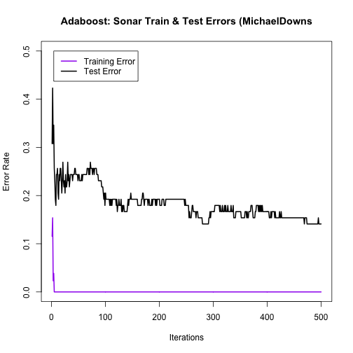
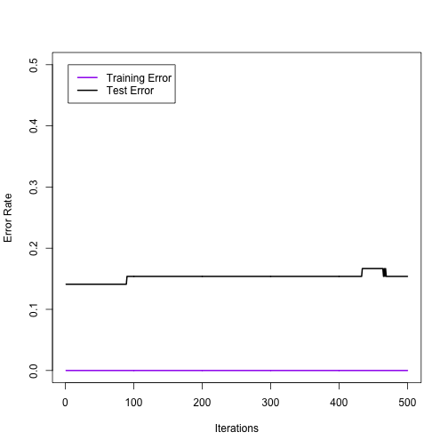

AdaBoost
========================================================

### Load test and train data

```r
setwd("./data")
train<-read.csv("sonar_train.csv",header=FALSE)
test<-read.csv("sonar_test.csv",header=FALSE)
setwd("../")

y<-train[,61]
x<-train[,1:60]
y_test<-test[,61]
x_test<-test[,1:60]
```

### Initialize counters
 

```r
iter=500

train_error<-rep(0,iter) # Keep track of errors
test_error<-rep(0,iter)
f<-rep(0,130) # 130 pts in training data
f_test<-rep(0,78) # 78 pts in test data

sumW<-rep(0,iter)
sumW_test<-rep(0,iter)

sumWnorm<-rep(0,iter)
sumWnorm_test<-rep(0,iter)

par(mfrow=(c(1,2)))
```

### Process Baseline Adboost loop


```r
i<-1
library(rpart)

while(i<=iter){
     w<-exp(-y*f) # This is a shortcut to compute w
     sumW[i]<-sum(w)
     
     w_test<-exp(-y_test*f_test)
     sumW_test[i]<-sum(w_test)
     
     w<-w/sum(w)
     sumWnorm[i]<-sum(w)
     
     w_test<-w_test/sum(w_test)
     sumWnorm_test[i]<-sum(w_test)

     fit<-rpart(y~.,x,w,method="class")

     g<--1+2*(predict(fit,x)[,2]>.5) # make -1 or 1
     g_test<--1+2*(predict(fit,x_test)[,2]>.5)

     e<-sum(w*(y*g<0))
     
     alpha<-.5*log ( (1-e) / e )

     f<-f+alpha*g
     f_test<-f_test+alpha*g_test

     train_error[i]<-sum(1*f*y<0)/130
     test_error[i]<-sum(1*f_test*y_test<0)/78

     i<-i+1
}
```


```r
# plot log(w)
plot(seq(1,iter),test_error,type="l",ylim=c(0,0.5),ylab="Error Rate",
     xlab="Iterations",lwd=2,col="black")

lines(train_error,lwd=2,col="purple")

legend(4,0.5,c("Training Error","Test Error"),col=(c("purple","black")),lwd=2)
```

 


```r
i<-1
library(rpart)

while(i<=iter){
     w<-exp(-y*f) # This is a shortcut to compute w
     sumW[i]<-sum(w)
     
     w_test<-exp(-y_test*f_test)
     sumW_test[i]<-sum(w_test)
     
     w<-w/sum(w)
     sumWnorm[i]<-sum(w)
     
     w_test<-w_test/sum(w_test)
     sumWnorm_test[i]<-sum(w_test)

     fit<-rpart(y~.,x,w,method="class")

     g<--1+2*(predict(fit,x)[,2]>.5) # make -1 or 1
     g_test<--1+2*(predict(fit,x_test)[,2]>.5)

     e<-sum(w*(y*g<0))
     
     alpha<-0.1*(.5*log ( (1-e) / e ))

     f<-f+alpha*g
     f_test<-f_test+alpha*g_test

     train_error[i]<-sum(1*f*y<0)/130
     test_error[i]<-sum(1*f_test*y_test<0)/78

     i<-i+1
}
```


```r
# plot log(w)
plot(seq(1,iter),test_error,type="l",ylim=c(0,0.5),ylab="Error Rate",
     xlab="Iterations",lwd=2,col="black")

lines(train_error,lwd=2,col="purple")

legend(4,0.5,c("Training Error","Test Error"),col=(c("purple","black")),lwd=2)
```

 


```r
# plot log(w)
plot(seq(1,iter),log(sumW_test),type="l",ylab="Log Sum Dataset Exponential Loss (log(sum(w)))",xlab="Iterations",col="blue",lwd=2,main="Log of Exponential Loss on Sonar Train and Test (Michael Downs)")

lines(log(sumW),lwd=2,col="red")

legend("bottomright",.5,c("test","train"),col=c("blue","red"),lwd=2)
```

 
