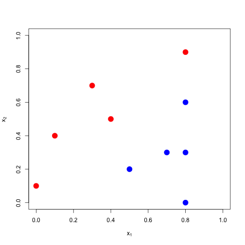
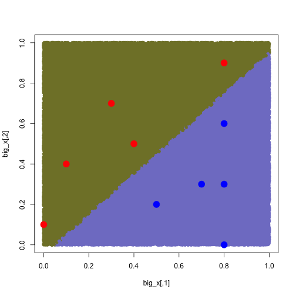

Support Vector Machines
========================================================

## 1 of 2: Exercise #35: Use SVM on sonar data. 


```r
library(e1071)
```

Same basic initialization of data. 


```r
setwd("./data")
train<-read.csv("sonar_train.csv",header=F)
test<-read.csv("sonar_test.csv",header=F)
setwd("../")

y<-as.factor(train[,61])
x<-train[,1:60]
```

Fit model using svm() defaults. Check resulting fit. 


```r
fit<-svm(x,y)
## fit an svm trained on x with class labels y.

fit
```

```
## 
## Call:
## svm.default(x = x, y = y)
## 
## 
## Parameters:
##    SVM-Type:  C-classification 
##  SVM-Kernel:  radial 
##        cost:  1 
##       gamma:  0.01667 
## 
## Number of Support Vectors:  97
```

```r
## like knn() fit doesn't give predictions directly.
## gives kernel used: "radial" implying it did some basic transforms.
## cost or (C) = 1
fit$cost
```

```
## [1] 1
```

```r
## gamma (a kernel parm) = 0.167
## nu parameter is k
fit$nu
```

```
## [1] 0.5
```

```r
y==predict(fit,x)
```

```
##   [1]  TRUE  TRUE  TRUE  TRUE  TRUE  TRUE  TRUE  TRUE  TRUE  TRUE  TRUE
##  [12]  TRUE  TRUE  TRUE  TRUE  TRUE  TRUE  TRUE  TRUE  TRUE  TRUE  TRUE
##  [23]  TRUE  TRUE  TRUE  TRUE  TRUE  TRUE  TRUE  TRUE  TRUE  TRUE  TRUE
##  [34]  TRUE  TRUE  TRUE  TRUE  TRUE  TRUE  TRUE  TRUE  TRUE  TRUE  TRUE
##  [45]  TRUE  TRUE  TRUE  TRUE  TRUE  TRUE  TRUE  TRUE  TRUE  TRUE  TRUE
##  [56]  TRUE  TRUE  TRUE  TRUE  TRUE  TRUE  TRUE  TRUE  TRUE  TRUE  TRUE
##  [67]  TRUE  TRUE  TRUE  TRUE  TRUE  TRUE  TRUE  TRUE  TRUE  TRUE  TRUE
##  [78]  TRUE  TRUE  TRUE  TRUE  TRUE  TRUE  TRUE  TRUE  TRUE  TRUE  TRUE
##  [89]  TRUE  TRUE  TRUE  TRUE  TRUE  TRUE  TRUE  TRUE  TRUE  TRUE  TRUE
## [100]  TRUE  TRUE  TRUE  TRUE  TRUE  TRUE FALSE  TRUE  TRUE  TRUE  TRUE
## [111]  TRUE  TRUE  TRUE  TRUE  TRUE  TRUE  TRUE  TRUE FALSE  TRUE  TRUE
## [122]  TRUE  TRUE  TRUE  TRUE  TRUE  TRUE  TRUE  TRUE  TRUE
```

```r
## y==predict(fit,x) give us all instances where our prediction fit the train y.

1-sum(y==predict(fit,x))/length(y)
```

```
## [1] 0.01538
```

```r
## .015 test error. Not that interesting b/c we evaluated fit on training data. 
```

So, let's use the model on the test data. 

```r
y_test<-as.factor(test[,61])
x_test<-test[,1:60]

1-sum(y_test==predict(fit,x_test))/length(y_test)
```

```
## [1] 0.1282
```

```r
## 0.13 test error. Pretty good SVM out of the box. Better than trees and knn.
```

## 2 of 2: Exercise #36: toy data.


```r
x1<-c(0,0.8,0.4,0.3,0.1,0.7,0.5,0.8,0.8,0.8)
x2<-c(0.1,0.9,0.5,0.7,0.4,0.3,0.2,0.6,0,0.3)
x<-cbind(x1,x2)
y<-as.factor(c(-1,-1,-1,-1,-1,1,1,1,1,1))
```

Start the plot.


```r
plot(x,pch=19,xlim=c(0,1),ylim=c(0,1),col=2*as.numeric(y),cex=2,
     xlab=expression(x[1]),ylab=expression(x[2]))
```

 

```r
## col convention is just saying set color based on the 1/-1 status of y var.
## expression(y[x]) does the subscripts. 
```

Use svm() with kernel="linear" and cost=100000 (so cost is very high for any miss class) to fit the toy 2D data below. Provide a plot of the resulting class rule. 


```r
fit<-svm(x=x,y=y,kernel="linear",cost=100000)

1-sum(y==predict(fit,x))/length(y)
```

```
## [1] 0
```

So, to visualize classification, generate a lot of numbers, run them thru your model, and color the output based on the label (class) prediction. 


```r
big_x<-matrix(runif(200000),ncol=2,byrow=T)

plot(big_x,col=rgb(0.5,0.5,0.2+0.6*as.numeric(predict(fit,big_x)==1)),pch=19)
points(x,pch=19,xlim=c(0,1),ylim=c(0,1),col=2*as.numeric(y),cex=2,
     xlab=expression(x[1]),ylab=expression(x[2]))
```

 
